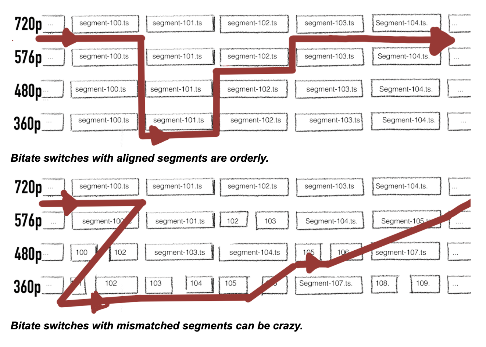

# Bento5

**Bento5 is a hackathon project based on Bento4 to generate better packaging results for HLS v3.**

We used to use Bento4 to generate HLS v3 streams. But sometimes we get playback issues like video skips and repeated scenes.

After doing some research, I think most of these are caused by bad segment alignment.

With Bento4, we can merge different bitrates of MP4 streams into one HLS stream, so the player could switch bitrates during playback. Ideally, all segments should be aligned. But sometimes H264 encoder will insert keyframes at different positions according to scene-detect result for different resolutions. Bento4 will generate an HLS stream for each mp4 file independently, so it is hard for it to make sure all segments are aligned.




Smart players can sync to the correct PTS before playback, some players will not, so video jumps.

mp42hls in Bento4 only accepts one MP4 file as the input, it is impossible to align for different bitrates. So I created a new tool named mov2hls to replace that.

There is an example in the `fixtures` folder, 3 video files from the same Ads video with different resolutions. I tried to use Bento4 to generate HLS v3 stream with following code:

```
python3 ~/tmp/Bento4/Source/Python/utils/mp4-hls.py --exec-dir ~/tmp/Bento4/ --hls-version=3 --segment-duration=6 ../240.mp4 ../360.mp4 ../480.mp4
```

The segment layout of the HLS v3 streams looks like:


Each rectangle represents a TS segment. We can see that at some positions, the segments are not aligned. Media-3 even has lesser segments than the other two streams.

When we use Bento5 to generate HLS 3 stream with following code:

```
mov2hls -o . -i ads/240.mp4,ads/360.mp4,ads/480.mp4 --segment-duration 6
```

The segment layout of the HLS v3 streams looks like:


All segments are aligned and we also choose the best position near `--segment-duration` to split the files.

## How to compile

```
git clone https://github.com/longlongh4/Bento5.git
cd Bento5
git submodule update --init --recursive
cmake .
make
```